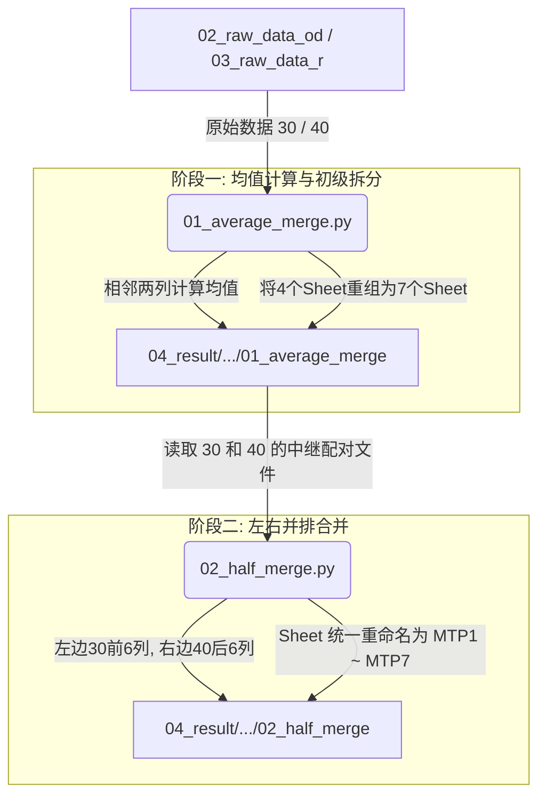

# Growth Profiler 数据处理流水线 (`n3_Overexpress_Library_ALL`)

这是一个专门用于处理与合并 Growth Profiler 生长测定仪输出的原始数据的 Python 数据处理流水线系统。该流水线支持对 **OD（光密度）** 和 **R（红光/发光等）** 数据进行两阶段的整理、均值计算和多板对照并列融合。

---

## 📂 项目目录结构

整个工作空间的数据和代码分布高度规范，分为以下几个主要部分：

```text
n3_Overexpress_Library_ALL/
│
├── 00_script/                  # 🐍 脚本目录
│   ├── 01_average_merge.py     # 第一阶段：均值计算与板块初级拆分
│   └── 02_half_merge.py        # 第二阶段：左30右40并列合并与统一命名
│
├── 01_raw_picture/             # 🖼️ 原始图片与 ezproj 实验项目工程文件
│
├── 02_raw_data_od/             # 📊 OD（光密度）原始 Excel 文件夹
│   └── Z1Z2_30.xlsx ... Z5Z6_40.xlsx
│
├── 03_raw_data_r/              # 📊 R（红光等）原始 Excel 文件夹
│   └── Z1Z2_R_30.xlsx ... Z5Z6_R_40.xlsx
│
└── 04_result/                  # 📁 结果输出主目录
    ├── OD/
    │   ├── 01_average_merge/   # 初步均值处理后的中继 OD Excel
    │   └── 02_half_merge/      # [最终产物] 左右并排合并后的 OD Excel (Z1 ~ Z6)
    └── R/
        ├── 01_average_merge/   # 初步均值处理后的中继 R Excel
        └── 02_half_merge/      # [最终产物] 左右并排合并后的 R Excel (Z1_R ~ Z6_R)
```

---

## ⚙️ 数据处理工作流 (Data Pipeline)

数据处理分为 **初级拆分与计算均值** 以及 **双板对照并列融合** 两个阶段：



### 🔹 第一阶段：均值计算与初级拆分 (`01_average_merge.py`)
- **功能描述**：
  - 自动扫描原始文件夹中的 `.xlsx` 文件。
  - 读取每个文件（包含 4 个或更多工作表，如 `1(1-6)`, `1(7-12)`...）。
  - **核心计算**：将数据列（除去前两列元数据外）按相邻两列（如第1列和第2列、第3列和第4列）交替计算均值，并在两列后插入名为 `*-*_Avg` 的均值列。
  - **重命名列名**：将数据列按照 `A1-A12`, `B1-B12` ... `H1-H12` 格式重命名。
  - **初级拆分**：将原来对应的 4 个工作表数据按孔位区间拆分为 `1(1-4)`, `1(5-8)`, `1(9-12)`, `2(1-4)`, `2(5-8)`, `2(9-12)`。若有第 5 个工作表，则单独作为 `H` 工作表。
- **输出路径**：
  - OD：`04_result\OD\01_average_merge\`
  - R：`04_result\R\01_average_merge\`

### 🔹 第二阶段：左右对照合并 (`02_half_merge.py`)
- **功能描述**：
  - 自动配对第一阶段生成的 `_30.xlsx` 与 `_40.xlsx` 中继文件。
  - **“左30右40”并排对照**：
    - 读取 `30` 表的指定孔区间列（如 `1-6` 列）作为左边前 6 列（新表头的 `1-6` 列，如 `A1-A6`）。
    - 读取 `40` 表的指定孔区间列作为右边后 6 列（新表头的 `7-12` 列，如 `A7-A12`）。
    - 从而完美实现 `_30` 组与 `_40` 组并排陈列以供快速对照。
  - **工作表（Sheet）统一命名**：
    无论哪个文件，合并后的 7 个 Sheet 均统一规范化命名为：
    1. `MTP1(1-2)`
    2. `MTP2(3-4)`
    3. `MTP3(5-6)`
    4. `MTP4(7-8)`
    5. `MTP5(9-10)`
    6. `MTP6(11-12)`
    7. `MTP7(last)`
- **输出路径**：
  - OD：`04_result\OD\02_half_merge\` (生成 `Z1.xlsx` 至 `Z6.xlsx`)
  - R：`04_result\R\02_half_merge\` (生成 `Z1_R.xlsx` 至 `Z6_R.xlsx`)

---

## 💻 运行环境与依赖说明

### 1. 运行环境
本流水线已经在您的 Windows 系统中通过以下环境测试：
* **Python 版本**：`Python 3.14.4`
* **Python 执行路径**：`C:\Users\Tsuki\AppData\Local\Python\bin\python.exe`

### 2. 依赖库
确保安装了以下处理 Excel 数据的核心库：
```bash
pip install pandas openpyxl
```

---

## 🚀 顺序执行说明

当您的原始数据目录更新时，请务必按照**顺序**在终端（如 Powershell）中执行以下两个命令完成全自动流水线处理：

#### 运行第一阶段（均值计算与初级拆分）：
```powershell
& "C:\Users\Tsuki\AppData\Local\Python\bin\python.exe" "F:\Growth_Profiler_Data\n3_Overexpress_Library_ALL\00_script\01_average_merge.py"
```

#### 运行第二阶段（对照合并）：
```powershell
& "C:\Users\Tsuki\AppData\Local\Python\bin\python.exe" "F:\Growth_Profiler_Data\n3_Overexpress_Library_ALL\00_script\02_half_merge.py"
```

---

## 🔔 注意事项
* **文件名匹配规范**：第二阶段脚本依靠文件名匹配工作。原始文件与中继文件请保证以 `_30.xlsx` 与 `_40.xlsx` 结尾（例如 `Z1Z2_30.xlsx`），若需要添加新样品，遵循 `ZxZy_30.xlsx` / `ZxZy_40.xlsx` 命名即可完美兼容。
* **文件锁警告**：在运行 Python 脚本处理前，**请先关闭任何已用 Excel 打开的对应文件**，以防出现 `PermissionError` 读写拒绝。
* **空工作表处理**：如遇到类似 `Z5Z6` 这种仅有 11KB 左右的空小文件，其 `H` 工作表内容若为空，脚本在执行合并时会发出缺失该工作表数据列的 `Warning` 警告，此属正常现象，脚本已对其作了安全保护，不会发生中断崩溃。
